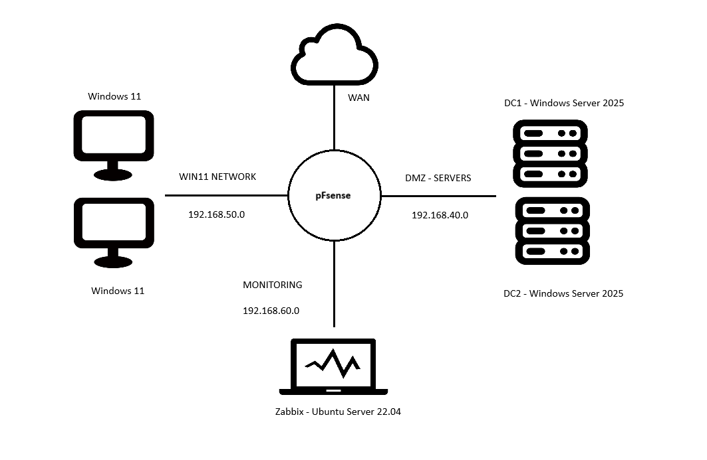

# Wdrożenie Scentralizowanej Infrastruktury IT (Windows Server 2025 & pfSense)

## 📌 O projekcie
Kompleksowe wdrożenie scentralizowanego środowiska IT dla przedsiębiorstwa, zrealizowane jako projekt inżynierski na Państwowej Akademii Nauk Stosowanych w Nysie. System integruje nowoczesne usługi katalogowe Microsoft z otwartoźródłowymi rozwiązaniami z zakresu cyberbezpieczeństwa oraz monitoringu.

## 🏗️ Architektura i technologie
Sercem projektu jest hiperwizor **Proxmox VE**, na którym uruchomiono odizolowane segmenty sieci w celu zapewnienia maksymalnego bezpieczeństwa.

* **Wirtualizacja:** Proxmox VE (Bare-metal).
* **Usługi Katalogowe:** Windows Server 2025 Datacenter (Główny oraz dodatkowy kontroler domeny).
* **Sieć i Bezpieczeństwo:** pfSense 2.7.2, system IDS/IPS Suricata, VPN (Tailscale oraz OpenVPN).
* **Monitoring:** Zabbix 7.4 (SNMP & Agenci) zainstalowany na systemie Ubuntu Server 22.04.

## 🌐 Projekt sieci
Infrastruktura została podzielona na logiczne strefy bezpieczeństwa zarządzane przez firewall pfSense:
* **WAN:** Dostęp zewnętrzny z wykorzystaniem dynamicznego DNS (DuckDNS).
* **DMZ (192.168.40.0/24):** Strefa zdemilitaryzowana dla serwerów Windows Server 2025.
* **LAN (192.168.50.0/24):** Sieć lokalna dla stacji roboczych Windows 11 pracujących w domenie.
* **Monitoring (192.168.60.0/24):** Wydzielona sieć przeznaczona dla serwera monitorującego Zabbix.

## 📸 Wizualizacja i Galeria
### Topologia sieci

*Opis: Schemat logiczny sieci zaprojektowany i wdrożony w środowisku Proxmox VE.*

### Struktura Active Directory

*Opis: Hierarchia jednostek organizacyjnych (OU) wdrożona w Windows Server 2025.*

## 🛡️ Kluczowe funkcjonalności
* **Active Directory:** Zaprojektowanie pełnej struktury jednostek organizacyjnych (OU), zarządzanie grupami oraz wdrożenie polityk GPO (mapowanie dysków, standaryzacja i hardening systemów).
* **Ochrona sieci:** Konfiguracja reguł firewalla na pfSense oraz implementacja systemu IDS/IPS Suricata do wykrywania i blokowania ataków w czasie rzeczywistym.
* **Dostęp zdalny:** Uruchomienie bezpiecznych tuneli VPN opartych na protokołach WireGuard (Tailscale) oraz SSL/TLS (OpenVPN) dla pracowników zdalnych.
* **Monitoring i Analityka:** Dashboardy Zabbix monitorujące kluczowe usługi (AD, DNS, DHCP) oraz wydajność sprzętową i dostępność maszyn wirtualnych.

## 📁 Dokumentacja
Pełna dokumentacja techniczna projektu w formacie PDF znajduje się w folderze `/doc`.
